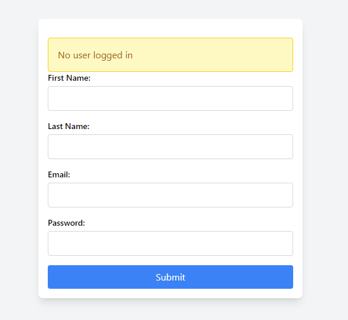
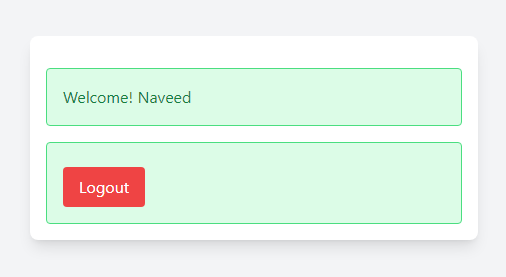

# react-contextAPI

This project is a simple React application that demonstrates the use of ContextAPI Vite for fast builds, Tailwind CSS for styling, and Context API for state management. It includes a login form and a profile component that displays user information.

## Features

- **Vite**: A fast build tool and development server for modern web projects.
- **Tailwind CSS**: A utility-first CSS framework for rapid UI development.
- **Context API**: For managing global state across the application.

### Login Screen



### Profile Screen



## Getting Started

### Prerequisites

Make sure you have the following installed on your machine:

- Node.js (version 14 or later)
- npm (version 6 or later) or Yarn (version 1.22 or later)

### Installation

1. **Clone the repository**

   ```bash
   git clone https://github.com/inaveed-git/react-ContextAPI.git
   cd react-contextAPI
   ```

2. **Install dependencies**

   Using npm:

   ```bash
   npm install
   ```

   Or using Yarn:

   ```bash
   yarn install
   ```

### Setting Up Vite

1. **Install Vite**

   If Vite is not already installed, you can install it globally using npm or Yarn:

   ```bash
   npm install -g create-vite
   ```

   Or:

   ```bash
   yarn global add create-vite
   ```

2. **Create a Vite project**

   If starting from scratch, you can create a new Vite project:

   ```bash
   npm create vite@latest
   ```

   Follow the prompts to set up your project. For an existing project, ensure `vite` is listed as a dependency in `package.json`.

### Setting Up Tailwind CSS

1. **Install Tailwind CSS**

   ```bash
   npm install -D tailwindcss postcss autoprefixer
   npx tailwindcss init -p
   ```

2. **Configure Tailwind CSS**

   Add the paths to all of your template files in the `tailwind.config.js` file:

   ```js
   module.exports = {
     content: ["./index.html", "./src/**/*.{js,ts,jsx,tsx}"],
     theme: {
       extend: {},
     },
     plugins: [],
   };
   ```

3. **Add Tailwind directives to your CSS**

   In your `src/index.css` file, add the following:

   ```css
   @tailwind base;
   @tailwind components;
   @tailwind utilities;
   ```

### Running the Application

1. **Start the development server**

   Using npm:

   ```bash
   npm run dev
   ```

   Or using Yarn:

   ```bash
   yarn dev
   ```

   The application should now be running on `http://localhost:3000`.

### Project Structure

- `App.jsx`: The main component that sets up the `UserContextProvider` and includes `Login` and `Profile` components.
- `context/UserContext.js`: Defines the context for user state.
- `context/UserContextProvider.jsx`: Provides the user context to the application.
- `component/Login.jsx`: Contains the login form and handles user login.
- `component/Profile.jsx`: Displays user information if the user is logged in.

### Conclusion

This project sets up a React application with Vite, Tailwind CSS, and Context API. It demonstrates how to manage global state using Context API and provides a simple example of user authentication with a login form and a profile display.
